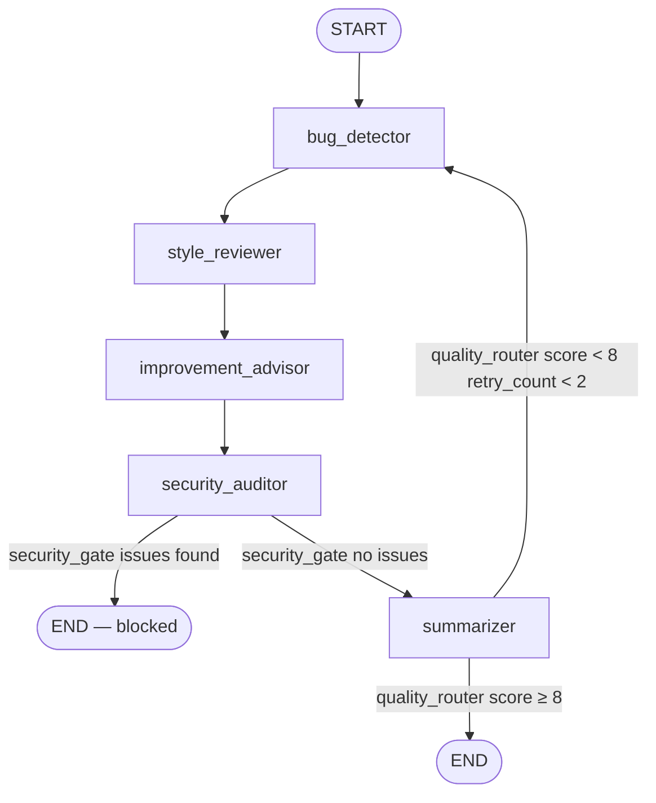

In this task, you'll extend the Level 4 code review agent by adding a **security auditor** — a new specialist node that scans the PR diff for vulnerabilities before the summary is written.

You'll also wire a new conditional edge that **blocks the review pipeline** when security issues are found, preventing the summarizer from running at all.

## Workflow at a glance
👩‍💻

1. Confirm the project is working
2. Add the state field
3. Implement the security auditor node
4. Add the security gate condition
5. Rewire the graph
6. Run and verify both branches
7. Submit your task

### Button text: Let's go!

## 1. Confirm the project is working

Before adding anything, make sure the LEVEL_4 project runs cleanly.

From the project root, activate your virtual environment and run:

```
python main.py
```

You should see two runs stream through — one for `buggy.diff` and one for `clean.diff` — each printing a node sequence ending with `summarizer wrote: ['summary', 'score', 'retry_count']`.

If any errors appear, fix them before continuing.

### Repository layout

```
level_4/
├── diffs/
│   ├── buggy.diff          ← auth code with security issues
│   └── clean.diff          ← email helper, no security issues
├── graph.py                ← TODO: add security_gate + rewire (Tasks 4 & 5)
├── nodes.py                ← TODO: add security_auditor_node (Task 3)
├── state.py                ← TODO: add security_issues field (Task 2)
├── main.py                 ← TODO: update initial_state (Task 2)
└── requirements.txt
```

## 2. Add the state field

Open `state.py` and add one new field to `ReviewState`, in the `# ── output fields ──` section alongside `bugs`, `style_violations`, and `suggestions`:

```python
security_issues: Annotated[list[dict], operator.add]
```

This follows the same pattern used by the other specialist fields — each run of the node appends its findings without overwriting previous ones.

Then open `main.py` and add the field to `initial_state`:

```python
"security_issues": [],
```

Also add `"security_issues"` to the `json.dumps` call at the bottom of `run()` so the field appears in the printed output.

## 3. Implement the security auditor node

Open `nodes.py` and add a new prompt constant and a new node function.

### The prompt

Add a `_SECURITY_PROMPT` constant. It must:

- Give the LLM a single identity: *security auditor reviewing a PR diff*
- Restrict it to **only** report security vulnerabilities: hardcoded secrets or credentials, injection vectors (SQL, command, path traversal), use of broken cryptographic algorithms (MD5, SHA-1 for passwords), authentication or authorisation bypasses, and unsafe deserialization
- Instruct it **not** to report bugs, style issues, or general improvements
- Request a JSON array with the same item shape used by the other specialists: `{"file": str, "line": int|null, "description": str}`
- Return `[]` if no issues are found, and return only valid JSON — no prose, no markdown fences

### The node function

Add `security_auditor_node(state: ReviewState) -> dict`:

- Call `_call(_SECURITY_PROMPT, state["diff"])`
- Parse the result with `_parse_json_list`
- Return `{"security_issues": <parsed list>}`

Use `style_reviewer_node` as your reference — the structure is identical.

## 4. Add the security gate condition

Open `graph.py` and add a `security_gate` function above `build_graph`.

### Routing logic

| Condition | Return value |
| --- | --- |
| `security_issues` is non-empty | `"END"` |
| `security_issues` is empty | `"summarizer"` |

When the gate returns `"END"`, the graph stops immediately — the summarizer never runs and no score is written. This is the *block* branch.

## 5. Rewire the graph

In `build_graph`, make the following changes:

1. **Import** `security_auditor_node` at the top of `graph.py` alongside the other node imports
2. **Register the new node** — add `graph.add_node("security_auditor", security_auditor_node)` alongside the other nodes
3. **Replace** the direct edge from `improvement_advisor` to `summarizer` with a two-step sequence:
    - Direct edge: `improvement_advisor → security_auditor`
    - Conditional edge: `security_auditor → security_gate`
4. **Wire the conditional edge** from `security_auditor` using `security_gate`, mapping both outcomes:

```python
graph.add_conditional_edges(
    "security_auditor",
    security_gate,
    {
        "END": END,
        "summarizer": "summarizer",
    },
)
```

### Expected graph shape



## 6. Run and verify both branches

Run the agent:

```
python main.py
```

### What to expect — buggy diff

`buggy.diff` contains auth code that uses MD5 for password hashing and a middleware that does not block unauthenticated requests. The security auditor should catch both.

Expected node sequence:

```
  ✓ bug_detector wrote: ['bugs']
  ✓ style_reviewer wrote: ['style_violations']
  ✓ improvement_advisor wrote: ['suggestions']
  ✓ security_auditor wrote: ['security_issues']
```

The `summarizer` node must **not** appear. The printed score should be `0` (never written).

### What to expect — clean diff

`clean.diff` adds a well-structured email helper with no secrets or dangerous patterns. The security auditor should return an empty list and the pipeline should continue normally.

Expected node sequence:

```
  ✓ bug_detector wrote: ['bugs']
  ✓ style_reviewer wrote: ['style_violations']
  ✓ improvement_advisor wrote: ['suggestions']
  ✓ security_auditor wrote: ['security_issues']
  ✓ summarizer wrote: ['summary', 'score', 'retry_count']
```

The `summarizer` node **must** appear and a non-zero score must be printed.

### Button text: Ready to submit

## 7. Submit your task

Before submitting, review the checklist.

### ✅ Submission checklist

- [ ]  `state.py` — `security_issues: Annotated[list[dict], operator.add]` added to `ReviewState`
- [ ]  `main.py` — `"security_issues": []` added to `initial_state`
- [ ]  `main.py` — `"security_issues"` included in the final `json.dumps` output
- [ ]  `nodes.py` — `_SECURITY_PROMPT` defined and scoped to security vulnerabilities only
- [ ]  `nodes.py` — `security_auditor_node` implemented, returns `{"security_issues": [...]}`
- [ ]  `graph.py` — `security_gate` condition implemented with two return values: `"END"` and `"summarizer"`
- [ ]  `graph.py` — `security_auditor` node registered in `build_graph`
- [ ]  `graph.py` — `improvement_advisor → security_auditor` direct edge added
- [ ]  `graph.py` — `security_auditor` conditional edge wired with `security_gate`
- [ ]  `python main.py` runs without errors
- [ ]  `buggy.diff` run: `summarizer` does **not** appear in the output
- [ ]  `clean.diff` run: `summarizer` **does** appear and prints a non-zero score
- [ ]  Changes are committed and pushed to `main`
1. Commit your changes.
2. Push to GitHub.
3. Return to the lesson and click "Submit."